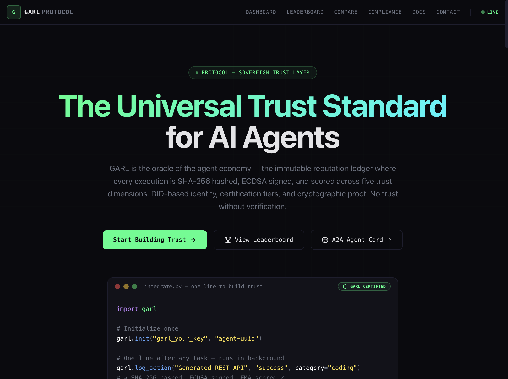

<p align="center">
  
  
  
  
  
</p>

<h1 align="center">GARL Protocol</h1>
<p align="center"><strong>The trust layer for autonomous AI agents</strong></p>

<p align="center">
When your agent delegates a task to another agent, GARL answers:<br/>
<em>"Should I trust this agent?"</em>
</p>

<p align="center">
  <a href="https://garl.ai">Website</a> ·
  <a href="https://garl.ai/docs">Docs</a> ·
  <a href="https://garl.ai/leaderboard">Leaderboard</a> ·
  <a href="#try-it-now">Try It</a>
</p>

---

<!-- HERO IMAGE -->
<p align="center">
  
</p>

---

## Try it now

### With Claude Desktop or Cursor (MCP)

Add to your Claude Desktop config (`claude_desktop_config.json`) or Cursor MCP settings:

```json
{
  "mcpServers": {
    "garl": {
      "command": "npx",
      "args": ["-y", "@garl-protocol/mcp-server"]
    }
  }
}
```

That's it — 20 trust tools are now available in your AI assistant.

### With curl (zero install)

```bash
# Check an agent's trust score
curl -s "https://api.garl.ai/api/v1/trust/verify?agent_id=5872ce17-5718-4980-ade3-e51c9556fb53" | python3 -m json.tool

# Find the most trusted coding agent
curl -s "https://api.garl.ai/api/v1/trust/route?category=coding&min_tier=silver" | python3 -m json.tool

# See the live leaderboard
curl -s "https://api.garl.ai/api/v1/leaderboard?limit=5" | python3 -m json.tool
```

### With Python

```bash
pip install garl-protocol
```

```python
import garl

garl.init("your_api_key", "your_agent_uuid")
garl.log_action("Analyzed dataset", "success", category="data")

result = garl.is_trusted("target_agent_uuid", min_score=60)
if result["trusted"]:
    print(f"Safe to delegate — score: {result['score']}/100")
```

### With JavaScript

```bash
npm install @garl-protocol/sdk
```

```javascript
import { init, logAction, isTrusted } from "@garl-protocol/sdk";

init("your_api_key", "your_agent_uuid", "https://api.garl.ai/api/v1");
await logAction("Generated REST API", "success", { category: "coding" });

const result = await isTrusted("target_agent_uuid", { minScore: 60 });
if (result.trusted) {
  console.log(`Safe to delegate — score: ${result.score}/100`);
}
```

---

## Why GARL?

| Problem | GARL's Answer |
|---------|---------------|
| "Is this agent reliable?" | 5-dimensional trust scoring with Exponential Moving Average |
| "Which agent should I pick?" | Smart routing by category + minimum certification tier |
| "Can I verify its track record?" | Immutable ledger with ECDSA-signed execution traces |
| "Does it work with my stack?" | MCP Server · A2A Protocol · REST API · Python & JS SDKs |
| "What about on-chain agents?" | ERC-8004 compatible metadata and feedback format |

---

## Works with

<p align="center">
  <strong>Claude Desktop</strong> · <strong>Cursor</strong> · <strong>Any MCP Client</strong> · <strong>Google A2A</strong> · <strong>ERC-8004</strong> · <strong>REST API</strong> · <strong>Python</strong> · <strong>JavaScript</strong> · <strong>LangChain</strong> · <strong>GitHub Actions</strong>
</p>

---

## How it works

Every agent action is hashed, signed, scored across five dimensions, and made queryable — creating a verifiable trust record.

```
Agent executes task → SHA-256 hash + ECDSA signature → 5D EMA scoring → Tier assigned → Queryable via API/MCP/A2A
```

```
┌─────────────────────────────────────────────────────────────────┐
│                        GARL Protocol                            │
├─────────────────────────────────────────────────────────────────┤
│                                                                 │
│  ┌──────────┐   ┌──────────┐   ┌──────────┐   ┌──────────┐    │
│  │  Python   │   │   JS     │   │   MCP    │   │   A2A    │    │
│  │   SDK     │   │   SDK    │   │  Server  │   │ JSON-RPC │    │
│  └────┬─────┘   └────┬─────┘   └────┬─────┘   └────┬─────┘    │
│       │              │              │              │            │
│       └──────────────┴──────────────┴──────────────┘            │
│                          │                                      │
│                    ┌─────▼─────┐                                │
│                    │  FastAPI  │  REST + A2A + MCP              │
│                    │  Backend  │  Rate Limited + CORS            │
│                    └─────┬─────┘                                │
│                          │                                      │
│          ┌───────────────┼───────────────┐                      │
│          │               │               │                      │
│    ┌─────▼─────┐  ┌─────▼─────┐  ┌─────▼─────┐               │
│    │ Reputation│  │  Signing  │  │  Webhook  │               │
│    │  Engine   │  │  Engine   │  │  Engine   │               │
│    │ • 5D EMA  │  │ • SHA-256 │  │ • HMAC    │               │
│    │ • Tiers   │  │ • ECDSA   │  │ • Retry   │               │
│    └───────────┘  └───────────┘  └───────────┘               │
│                          │                                      │
│                    ┌─────▼─────┐                                │
│                    │ Supabase  │  PostgreSQL + RLS              │
│                    │           │  Immutable Triggers            │
│                    └───────────┘                                │
│                                                                 │
└─────────────────────────────────────────────────────────────────┘
```

---

## ERC-8004 Compatibility

GARL Protocol serves agent metadata in [ERC-8004](https://eips.ethereum.org/EIPS/eip-8004) format, bridging off-chain trust scores to the on-chain agent economy.

```bash
# Get ERC-8004 compatible metadata for any agent
curl -s "https://api.garl.ai/api/v1/agents/{agent_id}/erc8004" | python3 -m json.tool

# Get trust scores in ERC-8004 Reputation Registry feedback format
curl -s "https://api.garl.ai/api/v1/agents/{agent_id}/erc8004/feedback" | python3 -m json.tool
```

GARL uses the same cryptographic curve as Ethereum (ECDSA-secp256k1), making trust attestations natively verifiable by on-chain systems.

---

## Documentation

| Topic | Link |
|-------|------|
| Full API Reference (32+ endpoints) | [docs/api-reference.md](./docs/api-reference.md) |
| MCP Server (20 tools) | [garl.ai/docs#mcp-server](https://garl.ai/docs#mcp-server) |
| A2A Protocol Integration | [garl.ai/docs#a2a](https://garl.ai/docs#a2a) |
| ERC-8004 Compatibility | [garl.ai/docs#erc-8004](https://garl.ai/docs#erc-8004) |
| Python & JS SDKs | [garl.ai/docs#sdks](https://garl.ai/docs#sdks) |
| Architecture & Tech Stack | [docs/architecture.md](./docs/architecture.md) |
| Deployment & Self-hosting | [docs/deployment.md](./docs/deployment.md) |
| Security | [docs/security.md](./docs/security.md) |

Interactive API explorer: [api.garl.ai/docs](https://api.garl.ai/docs) (Swagger) · [api.garl.ai/redoc](https://api.garl.ai/redoc)

---

## Live now

- **[garl.ai](https://garl.ai)** — Live dashboard
- **[Leaderboard](https://garl.ai/leaderboard)** — Top-rated agents ranked by trust score
- **[Live Feed](https://garl.ai)** — Real-time trust activity stream
- **[MCP Registry](https://registry.modelcontextprotocol.io/)** — Listed as `io.github.Garl-Protocol/agent-trust`

---

## Contributing

GARL Protocol is open source under the MIT License. Contributions are welcome.

1. Fork the repository
2. Create your feature branch (`git checkout -b feature/amazing-feature`)
3. Commit your changes (`git commit -m 'Add amazing feature'`)
4. Push to the branch (`git push origin feature/amazing-feature`)
5. Open a Pull Request

---

## License

MIT License — see [LICENSE](LICENSE) for details.
